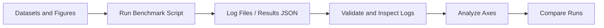

# Experiments: Analytical Guide

This file explains everything in `experiments/` in a linear, readable order. It focuses on data flow, inputs, outputs, and failure modes so you can read it offline without jumping around.

**Reading order**
1. Shared inputs and outputs
2. Script and notebook reference
3. Diagnostics and analysis helpers
4. Common pitfalls and fixes
5. Suggested run flow

**Shared inputs and outputs**
- `benchmark/questions/` holds case question JSON files. Most benchmark scripts enumerate this tree and treat each file as one multiple choice question.
- `data/eurorad_metadata.json` maps case IDs to case metadata and figures. `benchmark_gpt4o.py`, `benchmark_llama.py`, and `benchmark_medrax.ipynb` use it to resolve figure URLs.
- `benchmark/figures/` is used by `benchmark_medrax.ipynb` when it builds local figure paths from figure numbers. The notebook assumes images are already extracted.
- `data/chexbench_updated.json` is expected by `chexbench_gpt4.py` but is not present in this repo. You need to create it from the CheXbench data after you download images and fix local paths.
- `medrax/data/updated_cases.json` is expected by `benchmark_chexagent.py` but is not present in this repo. You need to generate or place it yourself.
- `MedMAX/data/updated_cases.json` and `MedMAX/benchmark/questions` are expected by `benchmark_llavamed.py`. These are legacy paths from a previous project name. You can adapt the script or create a `MedMAX` folder pointing at the same data.
- Output directories are created on demand. Most scripts emit JSON logs under the current directory or in `experiments/results/` or `experiments/benchmark_results/`.

**Log and result formats**
- JSON Lines logs: `benchmark_gpt4o.py`, `benchmark_llama.py`, and `benchmark_chexagent.py` write one JSON object per line. Each entry includes `case_id`, `question_id`, `model_answer`, `correct_answer`, and an `input` payload with the question and image references. These files are the input for `analyze_axes.py`, `compare_runs.py`, `inspect_logs.py`, and `validate_logs.py`.
- LLaVA JSON results: `benchmark_llavamed.py` writes a single JSON file with a `results` list and a `summary` section. `compare_runs.py` has a special branch to parse this format.
- CheXbench JSON results: `chexbench_gpt4.py` writes `results/batch_results_*.json` containing a list of results with `input` and `output` sections.

**Script and notebook reference**

**`benchmark_gpt4o.py`**
- Purpose: Run ChestAgentBench using OpenAI GPT-4o with image URLs embedded in the request payload.
- Inputs: `data/eurorad_metadata.json`, `benchmark/questions/`, and `OPENAI_API_KEY`.
- Outputs: `api_usage_*.json` JSON Lines log in the current working directory.
- Key logic: Resolves figure numbers to subfigure URLs, constructs a multimodal prompt, and logs timing, token usage, and a cost estimate.
- Failure modes: Missing images produce a `status: "skipped"` log entry. Rate limiting logs an error and retries with exponential backoff.

**`benchmark_llama.py`**
- Purpose: Run ChestAgentBench using Llama 3.2 Vision 90B via OpenRouter.
- Inputs: `data/eurorad_metadata.json`, `benchmark/questions/`, and `OPENROUTER_API_KEY`.
- Outputs: `api_usage_*.json` JSON Lines log.
- Key logic: Verifies DNS and connection to OpenRouter, enforces a strict single letter output, and logs results per question.
- Failure modes: Connection or timeout errors trigger retry logic. Missing images are logged as skipped.

**`benchmark_chexagent.py`**
- Purpose: Run ChestAgentBench locally with the CheXagent model.
- Inputs: `medrax/data/updated_cases.json` for local image paths, `benchmark/questions/`.
- Outputs: `model_inference_*.json` JSON Lines log.
- Key logic: Loads `StanfordAIMI/CheXagent-2-3b`, builds a multimodal prompt with local image paths, and extracts a single letter answer.
- Failure modes: Missing images or model errors are logged as skipped or error entries.

**`benchmark_llavamed.py`**
- Purpose: Run ChestAgentBench through a LLaVA-Med server process.
- Inputs: `MedMAX/data/updated_cases.json` and `MedMAX/benchmark/questions` by default, plus a running controller and worker.
- Outputs: A live JSON log and a final JSON summary under `benchmark_results/`.
- Key logic: Resizes images, builds a LLaVA-Med conversation prompt, streams responses from the worker, validates answers, and writes detailed logs.
- Failure modes: Missing images are logged as skipped. Network errors are retried.

**`chexbench_gpt4.py`**
- Purpose: Run GPT-4o on CheXbench-style two-choice VQA data.
- Inputs: `data/chexbench_updated.json` and `OPENAI_API_KEY`.
- Outputs: `results/batch_results_*.json`.
- Key logic: Base64-encodes images, sends a two-choice prompt, and computes per-batch accuracy.
- Failure modes: Missing or oversized images raise errors and are logged per example.

**`benchmark_medrax.ipynb`**
- Purpose: End-to-end MedRAX evaluation on ChestAgentBench using the agent and tools.
- Inputs: `benchmark/questions/`, `data/eurorad_metadata.json`, and local model weights in `MODEL_DIR`.
- Outputs: JSON Lines logs under `experiments/medrax_logs/`.
- Key logic: Builds the tool list, instantiates the `Agent`, streams a full response and then a forced single-letter answer, and records agent state and raw response.

**`analyze_axes.py`**
- Purpose: Post-process JSON Lines logs into overall accuracy, category accuracy, and question-type accuracy.
- Inputs: A log file and a `--model` format selector.
- Outputs: Prints statistics to stdout and writes a `{model}_question_ids.json` file with correct and incorrect IDs.
- Key logic: Normalizes answer formats to a single letter and aggregates by metadata categories.

**`compare_runs.py`**
- Purpose: Compare multiple log files on the same set of questions.
- Inputs: Two or more log files.
- Outputs: Printed summary of overall accuracy and per-category accuracy on common questions.
- Key logic: Extracts letter answers, filters to common `(case_id, question_id)` pairs, and prints sample extraction traces for debugging.

**`inspect_logs.py`**
- Purpose: Human-readable inspection of log entries.
- Inputs: A log file or the latest `api_usage_*.json` file.
- Outputs: Printed entry summaries with prompts, images, answers, and token usage.
- Key logic: Detects the model type and formats accordingly.

**`validate_logs.py`**
- Purpose: Detect missing images and error entries in JSON Lines logs.
- Inputs: A log file or the latest `api_usage_*.json` file.
- Outputs: Printed lists of missing-image entries and error summaries.
- Key logic: Inspects message payloads for `image_url` entries.

**Common pitfalls and fixes**
- Path mismatches: `benchmark_llavamed.py` uses `MedMAX/...` and `benchmark_chexagent.py` uses `medrax/data/...`. Align these paths or create matching directories.
- Missing datasets: `data/chexbench_updated.json` and `medrax/data/updated_cases.json` are not in this repo. You must download datasets and generate these files yourself.
- Missing API keys: `OPENAI_API_KEY` and `OPENROUTER_API_KEY` are required for the GPT-4o and OpenRouter scripts.
- Missing images: If figures are missing or not resolved, scripts will skip questions. `validate_logs.py` helps find these.

**Suggested run flow**
1. Prepare benchmark data under `benchmark/` and `data/`, including images and any `updated_cases.json` mapping files.
2. Run one model script to produce a JSON Lines log or a LLaVA results file.
3. Inspect the log with `inspect_logs.py` and `validate_logs.py`.
4. Analyze accuracy with `analyze_axes.py`.
5. Compare multiple models with `compare_runs.py`.

**Diagram: Typical experiment flow**

