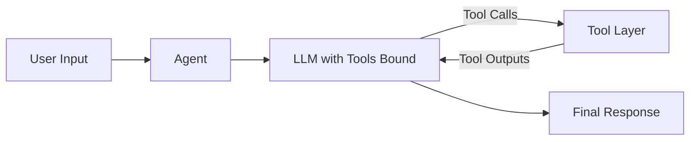

# MedRAX Package Overview and Reading Order

This is part 1 of 4. It provides the map and reading order for the `medrax` package.

**Reading order**
1. `medrax/docs/01-overview.md`
2. `medrax/docs/02-agent-and-prompts.md`
3. `medrax/docs/03-tools.md`
4. `medrax/docs/04-llava-stack.md`

**What the package does**
MedRAX is a tool-augmented agent for chest X-ray reasoning. The core package provides:
- An agent loop that calls tools based on model tool calls.
- A suite of tools for classification, segmentation, grounding, report generation, and VQA.
- A bundled LLaVA-Med stack to run local multimodal models and serve them.
- Prompt loading utilities and system prompts.

**High-level data flow**
```
User input -> Agent -> LLM -> Tool calls -> Tool outputs -> LLM -> Final answer
```
The Agent runs a small LangGraph state machine that alternates between model inference and tool execution until no tool calls remain.

**Diagram: End-to-end flow**


**Package map**
- `medrax/__init__.py` is empty and marks the package.
- `medrax/agent/agent.py` implements the core Agent class and tool-call loop.
- `medrax/docs/system_prompts.txt` contains named system prompts.
- `medrax/utils/utils.py` loads prompt sections and optionally merges tool descriptions from a JSON file.
- `medrax/tools/` contains all tool implementations. See `medrax/docs/03-tools.md`.
- `medrax/llava/` contains the LLaVA-Med model stack, server, and eval utilities. See `medrax/docs/04-llava-stack.md`.

**Configuration and runtime knobs**
- `OPENAI_API_KEY` is required for OpenAI and for moderation checks in the LLaVA Gradio server if `--moderate` is enabled.
- `OPENAI_BASE_URL` and `OPENAI_MODEL` can be set for OpenAI-compatible providers, used by your outer application rather than this package directly.
- Most tools accept a `device` argument, usually `cuda` or `cpu`.
- Most model-heavy tools accept a `cache_dir` or `model_path` to locate weights.
- Temporary outputs are written to per-tool `temp_dir` folders if provided.
- Tool call logs are written to `logs/` by default when `log_tools=True`.

**Typical usage pattern**
1. Choose tools from `medrax/tools` and instantiate them with the right `cache_dir`, `model_path`, and `device`.
2. Load a system prompt from `medrax/docs/system_prompts.txt` or your own file.
3. Create an `Agent` from `medrax/agent/agent.py` with a tool-capable LLM.
4. Stream messages through `agent.workflow` and handle responses.

This overview is intentionally short. The next three documents drill into the agent loop, tools, and the LLaVA stack in detail.
