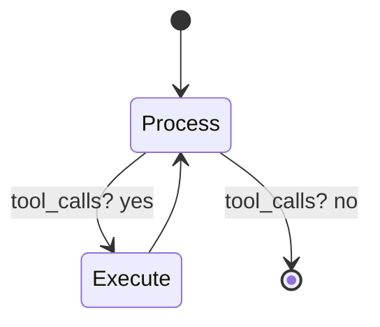

# Agent, State, and Prompt Assembly

This is part 2 of 4. It covers the agent loop, prompt assembly, and how tool definitions are exposed.

**Core files**
- `medrax/agent/agent.py`
- `medrax/docs/system_prompts.txt`
- `medrax/utils/utils.py`
- `medrax/tools/__init__.py`

**Agent workflow in `medrax/agent/agent.py`**
- `AgentState` is a TypedDict with a single field `messages`, appended across turns.
- The workflow is a LangGraph `StateGraph` with two nodes.
- Node `process` calls the model and returns the model response.
- Node `execute` runs tool calls and returns `ToolMessage` objects.
- A conditional edge loops back to `execute` if the model emitted tool calls, else ends.

**Detailed step sequence**
1. The caller supplies a list of `AnyMessage` objects.
2. `process_request` prepends the system prompt if set and calls `self.model.invoke`.
3. `has_tool_calls` inspects `response.tool_calls`.
4. `execute_tools` iterates tool calls, looks up the tool by name, invokes it, and wraps results in `ToolMessage`.
5. The tool results are fed back into `process_request` until no tool calls remain.

**Diagram: Agent state machine**

**Tool registry and model binding**
- The constructor stores tools in `self.tools` with keys equal to `BaseTool.name`.
- The LLM is wrapped with `model.bind_tools(tools)`, so tool calls become part of the model response.
- If a tool name is unknown, the agent returns `invalid tool, please retry` for that call.

**Tool call logging**
- Enabled with `log_tools=True` (default).
- Logs are written to `log_dir` as `tool_calls_<timestamp>.json`.
- Each log entry includes `tool_call_id`, `name`, `args`, `content`, and `timestamp`.
- Logging is best-effort and does not affect inference.

**System prompts**
- `medrax/docs/system_prompts.txt` is a simple sectioned format with headers like `[MEDICAL_ASSISTANT]`.
- `load_prompts_from_file` reads the file and returns a dict of name to prompt text.
- Prompts are stitched line by line and preserve newlines between sections.

**Tool prompt composition**
- `load_tool_prompts` expects a `tools.json` file with fields `description`, `prompt`, `input_type`, and `return_type`.
- This repository does not include a `tools.json` file. If you want automated tool prompt injection, you must supply your own path.
- `load_system_prompt` merges a named system prompt with tool prompt text.

**Tool exports**
- `medrax/tools/__init__.py` re-exports all tool classes, enabling `from medrax.tools import *`.

**Practical example from the notebook**
- `experiments/benchmark_medrax.ipynb` shows a full agent setup.
- It loads a `MEDICAL_ASSISTANT` prompt, creates tools, instantiates `Agent`, and streams messages through `agent.workflow`.
- It then asks a follow-up prompt to force a single letter answer.

Next: `medrax/docs/03-tools.md` describes each tool implementation, their inputs, outputs, and dependencies.
