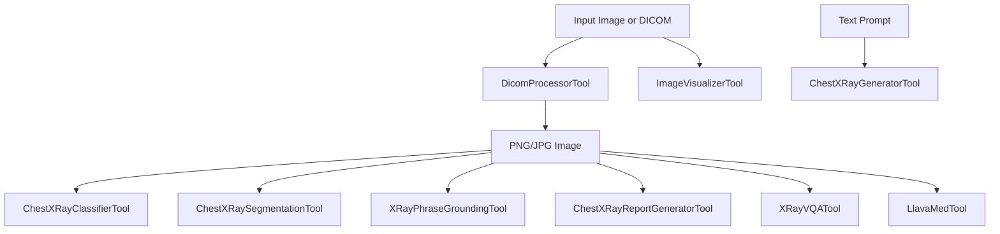

# Tool Reference

This is part 3 of 4. It documents every tool under `medrax/tools` with inputs, outputs, and operational notes.

**Common tool shape**
- Each tool subclasses `langchain_core.tools.BaseTool`.
- Each tool declares a Pydantic `args_schema` for validation.
- The `_run` method returns a tuple `(output, metadata)`.
- `_arun` usually delegates to `_run` without true async execution.

**Diagram: Tool landscape**

**`ImageVisualizerTool` in `medrax/tools/utils.py`**
- Purpose: Display or reference images with optional titles and descriptions.
- Input: `image_path` plus optional `title`, `description`, `figsize`, and `cmap`.
- Output: `{ "image_path": ... }` and metadata. The actual display call is currently commented out.
- Notes: Validates the file path exists. This is mostly a lightweight wrapper for UI use.

**`DicomProcessorTool` in `medrax/tools/dicom.py`**
- Purpose: Convert DICOM files to PNG and expose key metadata.
- Input: `dicom_path`, optional `window_center` and `window_width`.
- Output: `{ "image_path": ... }` and metadata including windowing and DICOM fields.
- Key logic: Applies rescale slope and intercept, then windowing if available, then normalizes to 8-bit.
- Notes: Useful when other tools only support JPG or PNG input.

**`ChestXRayClassifierTool` in `medrax/tools/classification.py`**
- Purpose: Multi-label pathology classification with TorchXRayVision DenseNet.
- Input: `image_path` (JPG or PNG).
- Output: Dict of 18 pathology probabilities and metadata.
- Key logic: Uses `xrv.datasets.normalize`, center crop, then DenseNet inference.
- Notes: The output probabilities are not calibrated to clinical risk and should be treated as model scores.

**`ChestXRaySegmentationTool` in `medrax/tools/segmentation.py`**
- Purpose: Segment anatomical structures and compute detailed metrics.
- Input: `image_path` and optional `organs` list.
- Output: `segmentation_image_path` and per-organ metrics including area, centroid, and intensity stats.
- Key logic: Runs PSPNet, thresholds masks, aligns masks back to the original image, and overlays colors.
- Notes: `pixel_spacing_mm` defaults to 0.2, so area in cm2 is approximate unless the source was DICOM with known spacing.

**`XRayPhraseGroundingTool` in `medrax/tools/grounding.py`**
- Purpose: Ground a medical phrase in the image and return bounding boxes.
- Input: `image_path`, `phrase`, and optional `max_new_tokens`.
- Output: Predictions with bounding boxes and a visualization image path.
- Key logic: Uses the MAIRA-2 processor to generate grounded outputs, adjusts boxes to original image size, and draws overlays.
- Notes: Supports 4-bit or 8-bit quantization for memory reduction.

**`ChestXRayReportGeneratorTool` in `medrax/tools/report_generation.py`**
- Purpose: Generate radiology-style findings and impression sections.
- Input: `image_path`.
- Output: A formatted report string and metadata.
- Key logic: Runs two ViT-BERT encoder-decoder models and combines outputs into a single report.
- Notes: Uses separate models for findings and impression, each loaded from Hugging Face.

**`XRayVQATool` in `medrax/tools/xray_vqa.py`**
- Purpose: General VQA on X-ray images via CheXagent.
- Input: `image_paths`, `prompt`, `max_new_tokens`.
- Output: A response string and metadata.
- Key logic: Formats images with `tokenizer.from_list_format` and runs `AutoModelForCausalLM.generate`.
- Notes: Temporarily overrides `transformers.__version__` to `4.40.0` during initialization for compatibility.

**`LlavaMedTool` in `medrax/tools/llava_med.py`**
- Purpose: Visual question answering using the local LLaVA-Med stack.
- Input: `question` and optional `image_path`.
- Output: The model answer and metadata.
- Key logic: Builds a LLaVA prompt with image tokens, processes the image with the LLaVA image processor, and runs generate.
- Notes: This is the primary consumer of the `medrax/llava` package.

**`ChestXRayGeneratorTool` in `medrax/tools/generation.py`**
- Purpose: Generate synthetic chest X-ray images from text.
- Input: `prompt` plus optional size and sampling parameters.
- Output: `{ "image_path": ... }` and metadata.
- Key logic: Uses a Stable Diffusion pipeline and writes output to a temp directory.
- Notes: The model weights are expected at `model_path`, which defaults to `/model-weights/roentgen`.

If you need deeper details on LLaVA internals, serving, or eval utilities, read `medrax/docs/04-llava-stack.md`.
