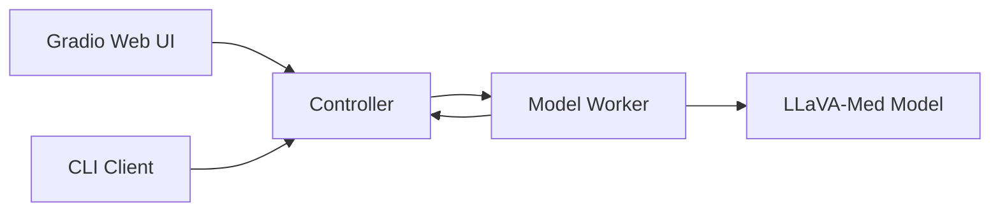
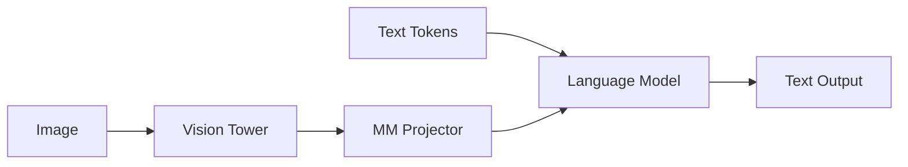

# LLaVA-Med Stack

This is part 4 of 4. It covers the bundled LLaVA-Med implementation under `medrax/llava`.

**Purpose in MedRAX**
- `medrax/llava` provides the model code and serving utilities required by `LlavaMedTool`.
- The same stack can be run as a standalone server with a controller and workers, or used for evaluation scripts.

**Diagram: Serving topology**

**Core utilities**

**`medrax/llava/constants.py`**
- Defines global constants for controller and worker heartbeats, log directory, and multimodal tokens.
- Tokens like `<image>` and `<im_start>` are used throughout the prompt and tokenizer logic.

**`medrax/llava/conversation.py`**
- Defines `Conversation` objects with roles, separators, and a prompt builder.
- `get_prompt` formats messages into the model specific instruction format.
- `get_images` extracts and optionally processes image data from mixed text and image message tuples.
- `conv_templates` provides ready-made templates like `vicuna_v1`, `llava_v1`, and `mistral_instruct`.

**`medrax/llava/mm_utils.py`**
- Provides image preprocessing, including padding to square and CLIP preprocessing.
- Implements `tokenizer_image_token` to inject image token IDs into the prompt.
- Defines `KeywordsStoppingCriteria` for generation stop conditions.

**`medrax/llava/utils.py`**
- Central logging setup that redirects stdout and stderr to log files.
- `disable_torch_init` disables default weight initialization for faster model startup.
- `violates_moderation` calls the OpenAI moderation API when enabled in the Gradio server.

**Model stack**

**`medrax/llava/model/builder.py`**
- Entry point to load the tokenizer, model, and image processor.
- Supports 4-bit or 8-bit quantization via BitsAndBytes.
- Adds image special tokens to the tokenizer and resizes embeddings.
- Loads and configures the vision tower and the multimodal projector.

**`medrax/llava/model/llava_arch.py`**
- Defines `LlavaMetaModel` and `LlavaMetaForCausalLM` which glue vision features into the language model.
- `prepare_inputs_labels_for_multimodal` replaces `<image>` tokens with projected image embeddings.
- `initialize_vision_tokenizer` adds image tokens and aligns embeddings with pretrained weights when needed.

**`medrax/llava/model/language_model/llava_mistral.py`**
- Implements a Mistral-based causal LM with multimodal support.
- Overrides `forward` to insert image embeddings and `generate` to accept images.

**`medrax/llava/model/multimodal_encoder/clip_encoder.py`**
- Wraps a CLIP vision tower and exposes `hidden_size` and `num_patches`.
- Selects either patch tokens or CLS plus patch tokens based on configuration.

**`medrax/llava/model/multimodal_projector/builder.py`**
- Builds a linear, MLP, or identity projector to map vision features into the LM hidden size.

**Diagram: Multimodal forward pass**

**Serving stack**

**`medrax/llava/serve/controller.py`**
- Runs a FastAPI controller that tracks workers and dispatches requests.
- Supports lottery or shortest-queue scheduling.
- Exposes endpoints for worker registration, model listing, and streaming generation.

**`medrax/llava/serve/model_worker.py`**
- Loads a model and handles streaming generation requests.
- Inserts image embeddings when images are present and streams tokens via a `TextIteratorStreamer`.
- Sends heartbeats to the controller and enforces a concurrency semaphore.

**`medrax/llava/serve/gradio_web_server.py`**
- Provides a Gradio UI that connects to the controller and streams responses.
- Builds prompts from `Conversation` templates and handles image upload and preprocessing.
- Optionally applies OpenAI moderation checks when `--moderate` is enabled.

**`medrax/llava/serve/cli.py`**
- Minimal CLI for interactive single-image inference from the command line.

**`medrax/llava/serve/register_worker.py`**
- Helper script to manually register a worker with a controller.

**`medrax/llava/serve/test_message.py`**
- Sends a text-only prompt to a worker for connectivity testing.

**`medrax/llava/serve/examples/`**
- Contains example images used by the Gradio demo.

**Eval utilities**

**`medrax/llava/eval/model_vqa.py`**
- Runs VQA inference on a JSONL question file and writes a JSONL answers file.
- Supports chunking for distributed evaluation.

**`medrax/llava/eval/eval_multimodal_chat_gpt_score.py`**
- Uses GPT-4 to score two model answers against a captioned visual context.
- Requires Azure OpenAI credentials configured in `medrax/llava/eval/llm.py`.

**`medrax/llava/eval/llm.py`**
- Defines an async GPT client and prompt splitting for Azure OpenAI.
- Includes token budgeting logic for long inputs.

**`medrax/llava/eval/summarize_gpt_review.py`**
- Aggregates GPT score outputs and prints a table of average scores.

**`medrax/llava/eval/util.py`**
- Small JSONL loader and average helper.

This completes the MedRAX package documentation. If you want a short quickstart summary or a new developer guide, say the word and I will add it.
